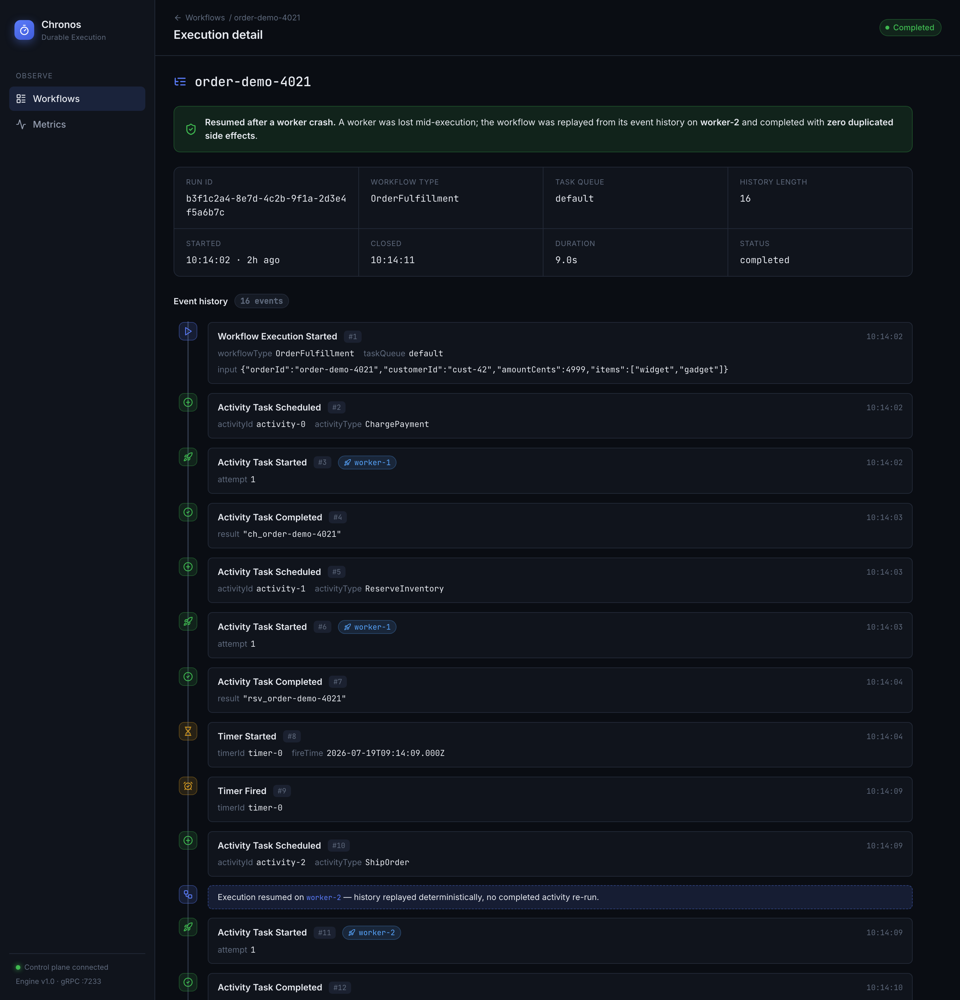
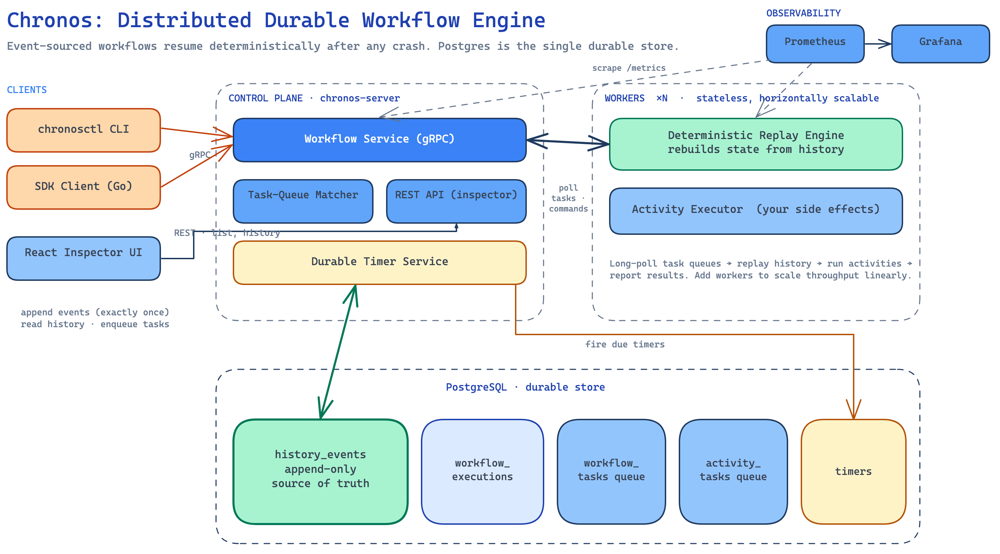
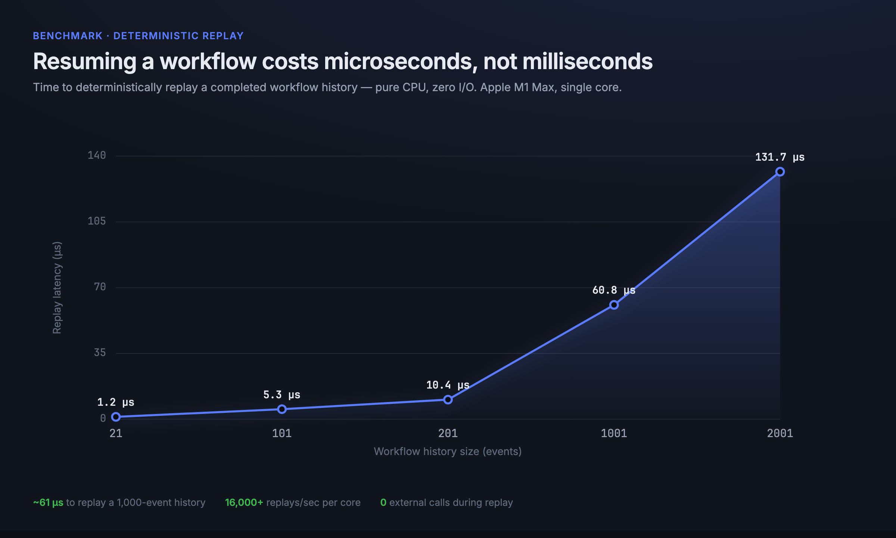

<div align="center">

# Chronos

**A distributed, durable workflow engine in Go, a focused mini-Temporal for exactly-once, crash-resumable workflows.**

[](https://github.com/AymanYouss/chronos-engine/actions/workflows/ci.yml)
[](https://go.dev)
[](LICENSE)

Deterministic replay of a **1,000-event** workflow history in **~61 µs** (p99 &lt; 0.15 ms), zero external calls.
Kill a worker mid-flight and the workflow resumes on another with **zero duplicated side effects.**

</div>

---

Chronos is the durable-execution backbone that long-running jobs and agent systems need. You write ordinary
Go functions; Chronos makes them **crash-proof**. Every workflow is event-sourced, so a process can die at any
instant and another worker will deterministically replay its history and continue from exactly where it left
off, never re-running work that already happened.



## Highlights

- **Event-sourced durability.** The workflow's event history is the single source of truth. State is never
  checkpointed; it is *derived* by replaying events, so recovery is exact by construction.
- **Deterministic replay.** A crashed workflow is rebuilt by re-executing its code against history. Completed
  activities return cached results instead of running again, the core of crash-resume correctness.
- **Exactly-once activities.** Results are recorded into history exactly once (enforced in Postgres), and an
  idempotency ledger makes side effects safe even under at-least-once dispatch.
- **Durable timers, retries & backoff.** Timers survive restarts; failed activities retry with exponential
  backoff and a configurable policy.
- **Horizontally scalable, stateless workers.** Workers pull from durable Postgres task queues via
  `SELECT … FOR UPDATE SKIP LOCKED`; add workers to scale throughput linearly.
- **A shipped-quality inspector UI.** List, filter and drill into executions; read the full event-history
  timeline and see exactly where a run was resumed on a different worker.
- **Production-ready.** gRPC control plane, Prometheus metrics, Grafana dashboards, Docker images, Kubernetes
  manifests, and a Terraform stack for EKS + RDS.

## Architecture



Chronos separates a stateless **control plane** (the durable brain) from stateless **workers** (where your
code runs). Postgres holds the event histories and the durable task queues.

| Component | Responsibility |
| --- | --- |
| **Control plane** (`chronos-server`) | gRPC API for clients and workers, task-queue matching, durable timer service, schema migrations, Prometheus metrics. |
| **Storage** (Postgres) | Append-only `history_events`, projected `workflow_executions`, and the `workflow_tasks` / `activity_tasks` durable queues. All invariants are enforced inside transactions. |
| **Worker SDK** | Long-polls task queues, deterministically replays workflow histories, and executes activities. Ships as an embeddable Go SDK. |
| **Inspector** (`web`) | React + TypeScript UI over the control-plane REST API. |

See [`docs/ARCHITECTURE.md`](docs/ARCHITECTURE.md) for the replay algorithm, the exactly-once proof sketch,
and the storage schema.

## Quickstart

```bash
# Bring up Postgres, the control plane, two workers, the inspector, Prometheus and Grafana.
docker compose up --build
```

| Service | URL |
| --- | --- |
| Inspector UI | <http://localhost:8088> |
| Control-plane REST API | <http://localhost:8080/api/workflows> |
| gRPC control plane | `localhost:7233` |
| Prometheus | <http://localhost:9099> |
| Grafana (anonymous admin) | <http://localhost:3000> |

Start a workflow and watch it run:

```bash
docker compose exec server /usr/local/bin/chronosctl \
  start -id order-1 -type OrderFulfillment \
  -input '{"orderId":"order-1","amountCents":4999,"items":["widget"]}'

docker compose exec server /usr/local/bin/chronosctl list
```

## The crash-and-resume demo

The headline guarantee, scripted end to end:

```bash
./scripts/demo-crash-resume.sh
```

The script starts the order-fulfillment workflow, waits until it is durably parked on its packaging timer
(payment charged + inventory reserved), **SIGKILLs the worker**, then starts a fresh worker. It asserts that:

- the workflow completes after resuming on a different worker,
- the idempotency ledger holds **exactly 4** side effects (one per activity), and
- the history holds **exactly 4** `ActivityTaskCompleted` events, **zero duplicates**.

Evidence is written to [`docs/portfolio/demo-evidence.txt`](docs/portfolio/demo-evidence.txt).

## Writing a workflow

```go
func OrderFulfillment(ctx workflow.Context, input []byte) ([]byte, error) {
    var in OrderInput
    _ = converter.Decode(input, &in)

    opts := workflow.ActivityOptions{StartToCloseTimeout: 30 * time.Second}

    var chargeID string
    if err := ctx.ExecuteActivity("ChargePayment", in, opts).Get(&chargeID); err != nil {
        return nil, err
    }
    if err := ctx.Sleep(5 * time.Second); err != nil { // durable timer
        return nil, err
    }
    var tracking string
    if err := ctx.ExecuteActivity("ShipOrder", in, opts).Get(&tracking); err != nil {
        return nil, err
    }
    return converter.Encode(OrderResult{ChargeID: chargeID, TrackingNo: tracking})
}
```

The function looks synchronous but is fully durable: each `ExecuteActivity` and `Sleep` becomes a persisted
event, and a crash at any line resumes at exactly that line.

## Performance

Deterministic replay is pure CPU work with no I/O, the cost of resuming a workflow. Measured on an Apple M1
Max (`go test -bench BenchmarkReplay`):



| History size | Replay latency | Throughput (1 core) |
| ---: | ---: | ---: |
| 21 events | 1.2 µs | ~805k/s |
| 101 events | 5.4 µs | ~187k/s |
| 201 events | 10.4 µs | ~96k/s |
| 1,001 events | 61 µs | ~16k/s |
| 2,001 events | 132 µs | ~7.6k/s |

## Deployment

- **Local:** `docker compose up --build`.
- **Kubernetes:** `kubectl apply -k deploy/k8s` (server Deployment, HPA-backed workers, ALB Ingress).
- **AWS:** `terraform apply` in [`deploy/aws`](deploy/aws) provisions VPC + EKS + Multi-AZ RDS + ECR.

Full instructions in [`deploy/README.md`](deploy/README.md).

## Project layout

```
api/proto        gRPC / protobuf contract (WorkflowService)
cmd/             chronos-server, chronos-worker, chronosctl
internal/
  storage/       Postgres event store, durable queues, timers
  server/        gRPC service implementation
  httpapi/       REST API for the inspector
  metrics/       Prometheus collectors
sdk/
  workflow/      deterministic replay engine (the core)
  worker/        polling runtime
  client/        gRPC client
workflows/       sample order-fulfillment workflow + activities
web/             React + TypeScript inspector UI
deploy/          Docker, Kubernetes, AWS (Terraform), Grafana, Prometheus
```

## Development

```bash
make proto     # regenerate gRPC code (needs buf)
make build     # build binaries
make test      # unit + Postgres integration tests
make cover     # coverage report
make up        # docker-compose stack
make demo      # crash-and-resume demonstration
```

The replay engine is covered by focused unit tests (`sdk/workflow`), and the storage guarantees
(exactly-once recording, resume, retries, durable timers) are covered by Postgres integration tests that run
against a service container in CI.

## License

MIT © Ayman Youss
